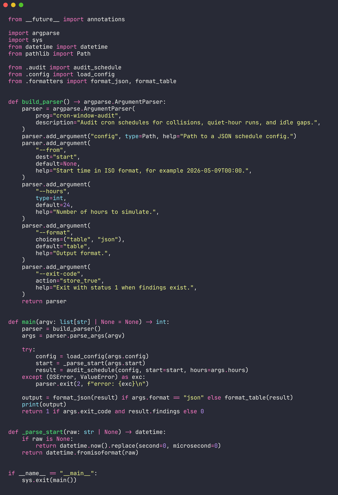
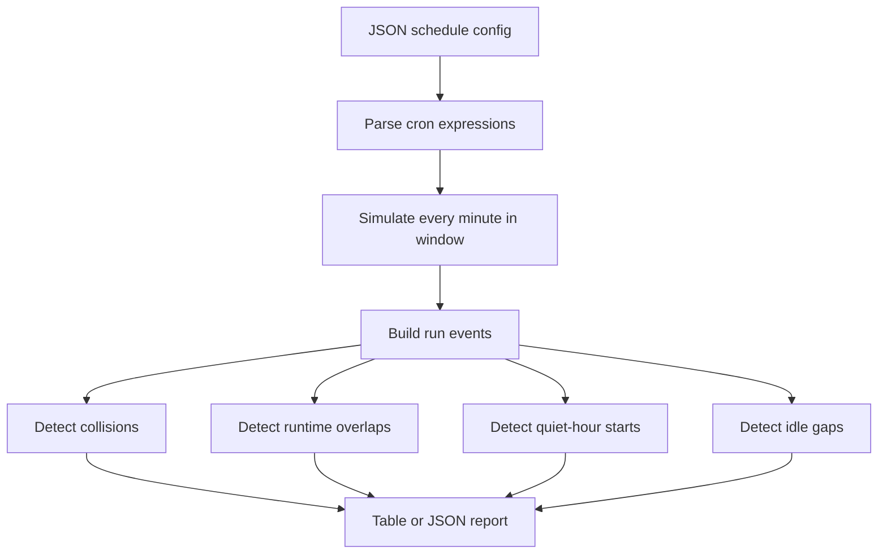

# cron-window-audit

Audit cron schedules before they create production noise.

| Checks | Finds |
| --- | --- |
| Start collisions | Two or more jobs firing on the same minute |
| Runtime overlaps | Long-running jobs crossing another job window |
| Quiet windows | Jobs that start during restricted hours |
| Idle gaps | Long periods with no scheduled job starts |




## Install

```bash
python3 -m pip install .
```

## Quick Start

```bash
cron-window-audit examples/jobs.json --from 2026-05-09T00:00 --hours 24
```

```text
severity  code             time              jobs                            message
--------  ---------------  ----------------  ------------------------------  --------------------------------
high      start_collision  2026-05-09T00:00  billing-rollup, warehouse-sync  2 jobs start at the same minute
medium    quiet_window     2026-05-09T02:15  search-reindex                  job starts inside a quiet window
low       idle_gap         2026-05-09T02:15  search-reindex, billing-rollup  no job starts for 225 minutes
```

## Workflow



## CLI

| Argument | Required | Default | Purpose |
| --- | --- | --- | --- |
| `config` | yes | - | JSON file containing jobs and audit rules |
| `--from` | no | current minute | ISO start time, for example `2026-05-09T00:00` |
| `--hours` | no | `24` | Simulation length |
| `--format` | no | `table` | Output as `table` or `json` |
| `--exit-code` | no | `false` | Return `1` when findings exist |

## Config

| Field | Type | Notes |
| --- | --- | --- |
| `jobs[].name` | string | Stable job name used in reports |
| `jobs[].cron` | string | Five-field cron expression |
| `jobs[].duration_minutes` | integer | Runtime estimate for overlap detection |
| `jobs[].tags` | string array | Optional metadata |
| `quiet_hours[].start` | `HH:MM` | Start of restricted window |
| `quiet_hours[].end` | `HH:MM` | End of restricted window, may cross midnight |
| `max_idle_minutes` | integer | Maximum allowed gap between job starts |

```json
{
  "quiet_hours": [{ "start": "22:00", "end": "06:00" }],
  "max_idle_minutes": 180,
  "jobs": [
    {
      "name": "billing-rollup",
      "cron": "0 */6 * * *",
      "duration_minutes": 35
    }
  ]
}
```

## Library Use

```python
from datetime import datetime
from cron_window_audit import AuditConfig, CronJob, audit_schedule

config = AuditConfig(jobs=(CronJob("billing-rollup", "0 */6 * * *"),))
result = audit_schedule(config, datetime(2026, 5, 9, 0, 0), hours=24)

print(result.findings)
```

## Development

```bash
PYTHONPATH=src python3 -m unittest discover -s tests
```
